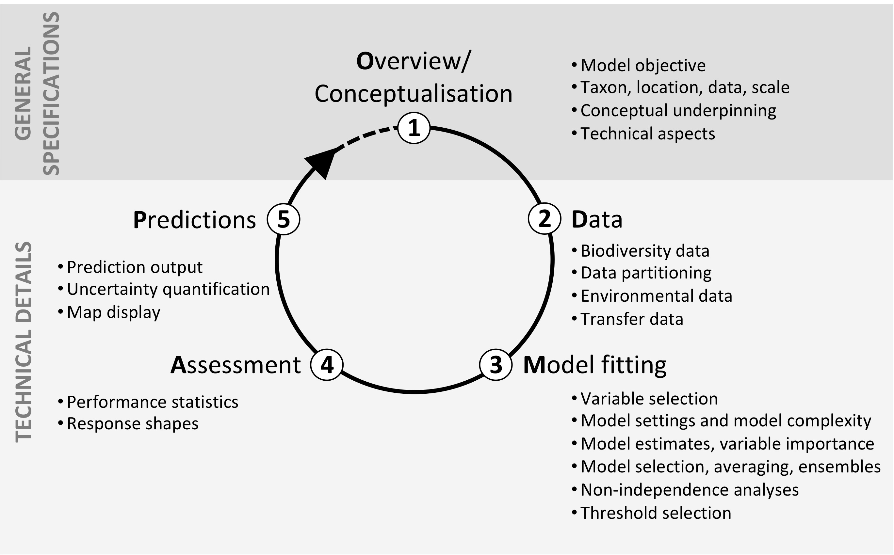

# ODMAP

** IMPORTANT: This repository is no longer maintained. The ODMAP repository has moved to: https://github.com/UP-macroecology/ODMAP **

Species distribution models (SDMs) constitute the most common class of biodiversity models. The advent of ready-to-use software packages and increasing availability of digital geo-information have considerably assisted the application of SDMs in recent years enabling their use in informing conservation and management, and quantifying impacts from global change.

However, models must be fit for purpose, with all important aspects of their development and applications properly considered. Despite the widespread use of SDMs, the standardisation and documentation of model protocols remains limited. To address these issues, we propose a standard protocol for reporting SDMs. We call this the ODMAP (Overview, Data, Model, Assessment and Prediction) protocol as each of its components reflects the main steps involved in building SDMs and other empirically-based biodiversity models.

The ODMAP protocol serves two main purposes. First, it provides a checklist for authors detailing key steps for model building and analyses. Second, it introduces a standard approach to documentation that ensures transparency and reproducibility, facilitating peer review and expert evaluation of model quality as well as meta-analyses.

This [Shiny web application](https://odmap.wsl.ch/) helps to implement the ODMAP approach and produces well formatted protocols that can be exported for further usage. For further explanation please refer to the original publication [(Zurell et al., 2020)](https://onlinelibrary.wiley.com/doi/full/10.1111/ecog.04960). 

Please cite as follows:

Zurell, D., Franklin, J., König, C., Bouchet, P.J., Dormann, C.F., Elith, J., Fandos, G., Feng, X., Guillera-Arroita, G., Guisan, A., Lahoz-Monfort, J.J., Leitão, P.J., Park, D.S., Peterson, A.T., Rapacciuolo, G., Schmatz, D.R., Schröder, B., Serra-Diaz, J.M., Thuiller, W., Yates, K.L., Zimmermann, N.E. and Merow, C. (2020), A standard protocol for reporting species distribution models. Ecography, 43: 1261-1277. https://doi.org/10.1111/ecog.04960
